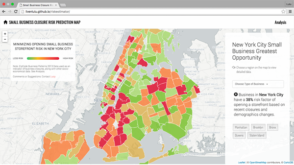

<kbd></kbd>

## [Small Business Closure Risk Prediction Map Demo](http://livenlulu.github.io/riskestimator/)

ZipCode Business Patterns 1998 - 2013 Data used as an indicator of business closures, along with other socio-economical data. See Analysis on site.